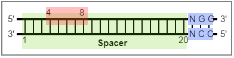

# Command-line version

We provided command-line versions that can be used to design the cytosine base editor mediated gene inactivation for large amounts of data. There are Perl and Python versions (CrisprCBEI.pl and CrisprCBEI.py).

The Python version shows richer information, and the Perl version is more computationally efficient.

# 3.1 CrisprCBEI.py

For the Python version, CrisprCBEI.py, only allows CBEI predictions.The next off-target prediction can be made using the existing tools.

## 3.1.1 Usage

```Python
python CrisprCBEI.py InputFile PAM SpLength EditBeg EditEnd Direction > result
# Example
python  CrisprCBEI.py lac.fa NGG 20 4 8 5 > result
```


> **InputFile**: CDS file in Fasta format. Support muti-genes.

> **PAM**: PAM sequence.

> **SpLength**: Spacer length.

> **EditBeg**: Edit windows begin.

> **EditEnd**: Edit windows end.

> **Direction**: 5 or 3. Spacer is at the 5 'end or 3' end of the PAM sequence. The example in the figure is the 5.

## 3.1.2 Output

>1. Fasta title: E.g., lacZ
>2. Strand: E.g., Plus
>3. Relative position: Edit position/Gene length. E.g., 0.012032520325203253
>4. Rich info: E.g., GT{C,GT[T,TTA,(C->T)]AA,CGT,CGT,GAC,T}|GG,G
>5. Spacer: E.g., CGTTTTACAACGTCGTGACT
>6. Spacer position: E.g., 30-49
>7. Edit position: E.g., 37
>8. Edit windows: E.g., 33-37
>9. PAM:E.g., GGG
>10. PAM position: E.g., 50-52
>11. Edit pattern: The edit pattern indicated the adjacent nucleotide at 5’ of the editable cytosine. Typically, the in vitro activity of the base editors follows TC ≥ CC ≥ AC > GC. E.g., AC

# 3.2 CrisprCBEI.pl

For more efficient computing, we have also introduced a Perl language version, CrisprCBEI.pl. We used this script on the server to calculate about 40,000 genomes (including most bacteria, fungi, plants, animals, etc.).

## 3.2.1 Usage

```bash
#same as python version
perl CrisprCBEI.pl lac.fa NGG 20 4 8 5 >result
```

## 3.2.2 Output

>1. Fasta title: E.g., lacZ
>2. Strand: E.g., Plus
>3. Spacer: E.g., CGTTTTACAACGTCGTGACT
>4. Spacer position: E.g., 30-49
>5. PAM:E.g., GGG
>6. PAM position: E.g., 50-52
>7. Relative position: Edit position/Gene length. E.g., 0.012032520325203253