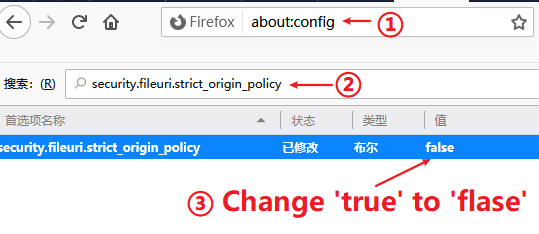

# Crispr-CBEI simple local version
This version allows the user to access the full capabilities of the CrisprCBEI with a simple HTML while offline.

---
**Please attention!**

```bash
In the off-target prediction part, we adopt the HTML5 WebWorker method. 

However, the current security settings of Chrome, Firefox and Opera do not allow files to run locally (i.e.,  does not support WebWorker run locally). Firefox could run WebWorker by changing security settings(more details below), but Chrome and Opera do not.

Of course, if all you need is CBEI predictions without off-target prediction, any HTML5 enabled browser could work.

It is worth noting that for Firefox user, changing the permission to run local files may pose a security risk while users browse other web pages, so be careful!!! 

Therefore, I recommend using the local server version for its safety and support all HTML5 enabled browser.

By the way, in other browser tests, Microsoft Edge can be used without security settings, which means it can run directly (IE 11 excepted).

Of course, if you use the online version ("https://taolab.nwsuaf.edu.cn/CrisprCBEI/"), all HTML5 enabled browser support it.

```
---

## Methods of Firefox that allow WebWorker to run locally




>1. Enter 'about:config'
>2. Search 'security.fileuri.strict_origin_policy'
>3. Change value to 'false'


