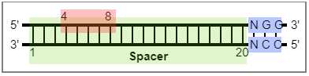

# CrisprCBEI.py

For the Python version, CrisprCBEI.py is more efficient and can compute large amounts of data. This python version only allows CBEI predictions.The next off-target prediction can be made using the existing tools.

## Usage

```Python
python CrisprCBEI.py InputFile PAM SpLength EditBeg EditEnd Direction > result
# Example
python  CrisprCBEI.py lac.fa NGG 20 4 8 5 > result
```


> **InputFile**: CDS file in Fasta format. Support muti-genes.

> **PAM**: PAM sequence.

> **SpLength**: Spacer length.

> **EditBeg**: Edit windows begin.

> **EditEnd**: Edit windows end.

> **Direction**: 5 or 3. Spacer is at the 5 'end or 3' end of the PAM sequence. The example in the figure is the 5.
