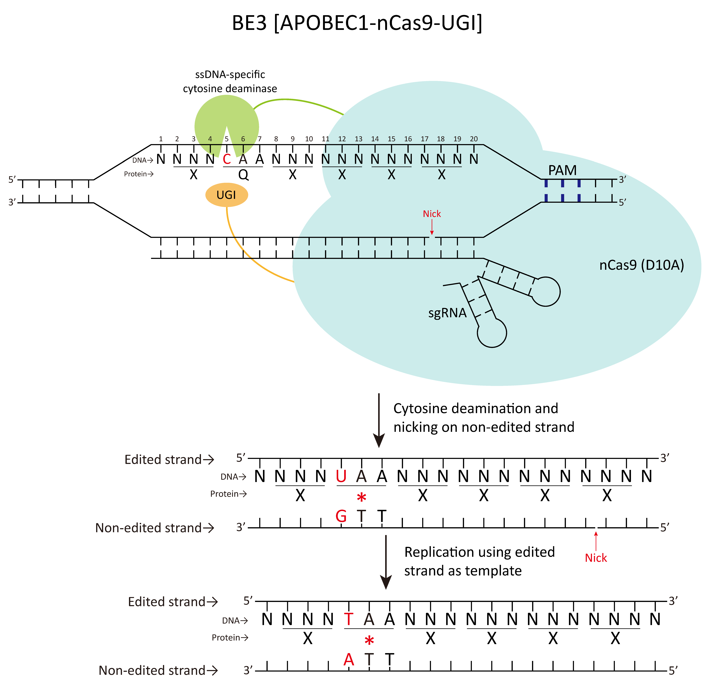
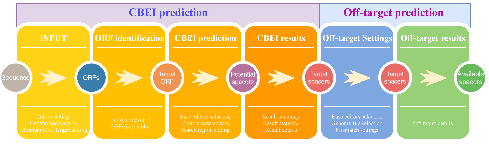

# CrisprCBEI
CrisprCBEI is a web-based designing tool for Cytosine Base Editor mediated gene Inactivation.

We launched both the online version and the Python version (the server version). Online version can access (https://taolab.nwsuaf.edu.cn/CrisprCBEI/) as well as establish the local server instead. 

CrisprCBEI online is a purely front-end software means that all calculations are performed locally, without the need to upload data to the server.Therefore, for the off-target prediction function, user can select local genome files of any size to make off-target prediction with a simple click. Of course, for the single-thread limitation of the browser, it is certainly not as efficient as the known server version of off-target prediction tools (such as CasOffinder). However, we have optimized the computational efficiency of this tool, and for the human genome (2.92gb) on a normal computer (i7 3770), each spacer only takes 83 seconds.For genomes less than 50MB, a spacer computation can take less than 1 second.This version we also made a detailed user manual, for everyone's convenience.

For the Python version, CrisprCBEI.py is more efficient and can compute large amounts of data. This python version only allows CBEI predictions.The next off-target prediction can be made using the existing tools.

## Crispr-CBEI online
CBEI and off-target can be predicted through simple settings in the browser.

CrisprCBEI online is a purely front-end software that, in theory, can run all of its functions with a click HTML file. We found that if we wanted to use miss prediction normally, we would have to set up a local server because we are using HTML5 web-work technology, and the browser does not allow it to run locally (if you know how to fix this, please contact me at atlasbioin4@gmail.com).

Therefore, we build a local server using 'Flask,' and you can use the full functions of the CrisprCBEI by simply entering a few lines of code.

Of course, you can use CrisprCBEI directly through our website (https://taolab.nwsuaf.edu.cn/CrisprCBEI/).

### Flow chart

The main functions of the software can be divided into CBEI prediction and off-target prediction, which can be seamlessly connected in actual operation. It is worth noting that our off-target prediction runs locally and does not limit genome file size.

### Installation

>1. Open the terminal to enter the folder "OnlineVersino".
>2. Run "pipenv install". (If you do not have 'pipenv', please run "pip install pipenv")
>3. Run "pipenv shell".
>4. Run "flask run".
>5. Open a HTML5 enabled browser and go "127.0.0.1:5000".

### User manual

For your convenience, we have written a detailed User manual. See 'CrisprCBEIUserManual.pdf' in folder.