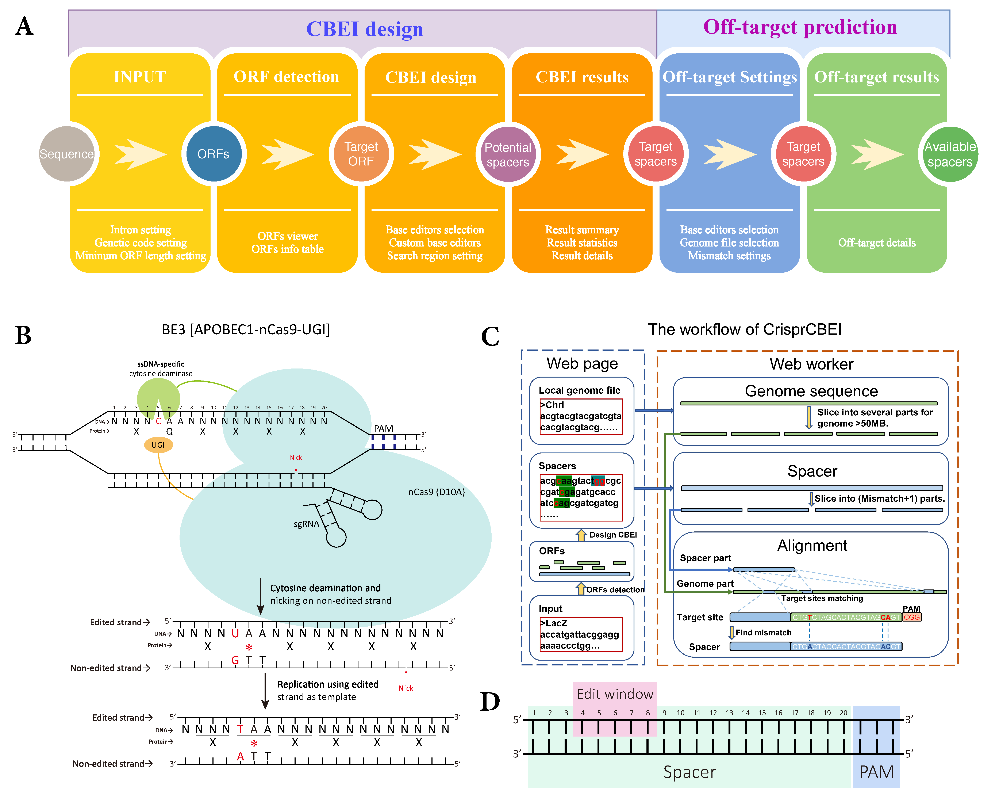

# CRISPR-CBEI

CRISPR-CBEI is dedicated to designing potential spacers for cytosine base editor mediated gene inactivation. The editing parameters of cytosine base editors are entirely customizable, including PAM, editing window, and search region. CRISPR-CBEI also integrated with visual ORF identification and interactive statistical charts. Furthermore, this designing tool also provides a pure front-end off-target prediction searching within size-unlimited user-defined genome file. The web serves, CRISPR-CBEI, is purely front-end computing without collecting any user information. 

Meanwhile, we also provide an offline version of CRISPR-CBEI, as well as a command-line version that can be used to design the cytosine base editor mediated gene inactivation for large amounts of data. 


<center> Figure 1. Schematic overview of CRISPR-CBEI. 

(A)The calculation process from user input to designed available spacers. (B) Schematic diagram of the Base editing. (C)The workflow of CRISPR-CBEI. The left part is the design process of cytosine base editor mediated gene inactivation, and the right part is front-end off-target prediction. (D) The composition diagram of base editors.</center>

## CrisprCBEI tool kits

CrisprCBEI is available in three versions to accommodate three usage scenarios: online, offline, and command line. All three versions have the function to design cytosine base editor mediated gene inactivation (CBEI). In addition, the web-based versions (both online and offline) also support ORF detection and off-target prediction on the web page. For the ‘online version,’ users can easily access through the website (https://taolab.nwsuaf.edu.cn/CrisprCBEI/). Next came the offline web version for offline computers, where we introduced the ‘HTML version’ and the ‘local server version.’ CrisprCBEI is a pure front-end computing tool, so in the HTML version, users can click directly on the HTML file to run it in the browser. However, due to browser security settings, the HTML version only supports a few browsers, so we introduced the local server version. The local server version of CrisprCBEI uses a lightweight server framework, Flask, that allows users to set up a local server in a few simple command lines and to use CrisprCBEI in main browsers. Finally, we have released a command-line version that can efficiently predict a large number of ORFs. The source code and detailed instructions of the above versions are stored in Github for open access (https://github.com/atlasbioinfo/CrisprCBEI).

## 1. CrisprCBEI online version
The online version can access from (https://taolab.nwsuaf.edu.cn/CrisprCBEI/), 

## 2. CrisprCBEI offline version

The offline version is divided into the local server version and the HTML version.

### 2.1 HTML version
This version allows the user to access the full capabilities of the CrisprCBEI with a simple HTML while offline.

It should be said that although we present the offline version, but we still recommend the most simple way, which directly use the online version (" https://taolab.nwsuaf.edu.cn/CrisprCBEI/ ").

---
**Please attention!**

```bash
In the off-target prediction part, we adopt the HTML5 WebWorker method. 

However, the current security settings of Chrome, Safari, Firefox and Opera do not allow files to run locally (i.e.,  does not support WebWorker run locally). Microsoft Edge can be used without security settings, which means it can run directly (IE 11 excepted). Firefox could run by changing security settings (more details below), but Chrome, Safari and Opera may not.

Of course, if all you need is CBEI predictions without off-target prediction, any HTML5 enabled browser could work.

It is worth noting that for Firefox user, changing the permission to run local files may pose a security risk while users browse other web pages, so be careful!!! 

Therefore, I recommend using the local server version for its safety and support all HTML5 enabled browser.

Of course, if you use the online version ("https://taolab.nwsuaf.edu.cn/crisprcbei/"), all HTML5 enabled browser support it.

```
---

#### Methods of Firefox that allow WebWorker to run locally


>1. Enter 'about:config'
>2. Search 'security.fileuri.strict_origin_policy'
>3. Change value to 'false'


### 2.2 Local server version

CrisprCBEI is pure front-end software, so we first introduced the HTML version, which can run the software in a browser by merely opening an HTML file. However, due to browser security settings, the HTML version only works in a few browsers (currently available in tests with Firefox and Microsoft Edge browsers).So we launched the local server version at the same time.This version can build a local server with a simple command to run in any HTML5 enabled browser (currently all the major browsers).

#### 2.2.1 Installation

>1. Open the terminal to enter the folder "OnlineVersino".
>2. Run "pipenv install". (If you do not have 'pipenv', please run "pip install pipenv")
>3. Run "pipenv shell".
>4. Run "flask run".
>5. Open a HTML5 enabled browser and go "127.0.0.1:5000".


## 3. Command-line version

We provided command-line versions that can be used to design the cytosine base editor mediated gene inactivation for large amounts of data. There are Perl and Python versions (CrisprCBEI.pl and CrisprCBEI.py).

The Python version shows richer information, and the Perl version is more computationally efficient.

### 3.1 CrisprCBEI.py

For the Python version, CrisprCBEI.py, only allows CBEI predictions.The next off-target prediction can be made using the existing tools.

#### 3.1.1 Usage

```Python
python CrisprCBEI.py InputFile PAM SpLength EditBeg EditEnd Direction > result
# Example
python  CrisprCBEI.py lac.fa NGG 20 4 8 5 > result
```


> **InputFile**: CDS file in Fasta format. Support muti-genes.

> **PAM**: PAM sequence.

> **SpLength**: Spacer length.

> **EditBeg**: Edit windows begin.

> **EditEnd**: Edit windows end.

> **Direction**: 5 or 3. Spacer is at the 5 'end or 3' end of the PAM sequence. The example in the figure is the 5.

#### 3.1.2 Output

>1. Fasta title: E.g., lacZ
>2. Strand: E.g., Plus
>3. Relative position: Edit position/Gene length. E.g., 0.012032520325203253
>4. Rich info: E.g., GT{C,GT[T,TTA,(C->T)]AA,CGT,CGT,GAC,T}|GG,G
>5. Spacer: E.g., CGTTTTACAACGTCGTGACT
>6. Spacer position: E.g., 30-49
>7. Edit position: E.g., 37
>8. Edit windows: E.g., 33-37
>9. PAM:E.g., GGG
>10. PAM position: E.g., 50-52
>11. Edit pattern: The edit pattern indicated the adjacent nucleotide at 5’ of the editable cytosine. Typically, the in vitro activity of the base editors follows TC ≥ CC ≥ AC > GC. E.g., AC

### 3.2 CrisprCBEI.pl

For more efficient computing, we have also introduced a Perl language version, CrisprCBEI.pl. We used this script on the server to calculate about 40,000 genomes (including most bacteria, fungi, plants, animals, etc.).

#### 3.2.1 Usage

```bash
#same as python version
perl CrisprCBEI.pl lac.fa NGG 20 4 8 5 >result
```

#### 3.2.2 Output

>1. Fasta title: E.g., lacZ
>2. Strand: E.g., Plus
>3. Spacer: E.g., CGTTTTACAACGTCGTGACT
>4. Spacer position: E.g., 30-49
>5. PAM:E.g., GGG
>6. PAM position: E.g., 50-52
>7. Relative position: Edit position/Gene length. E.g., 0.012032520325203253
