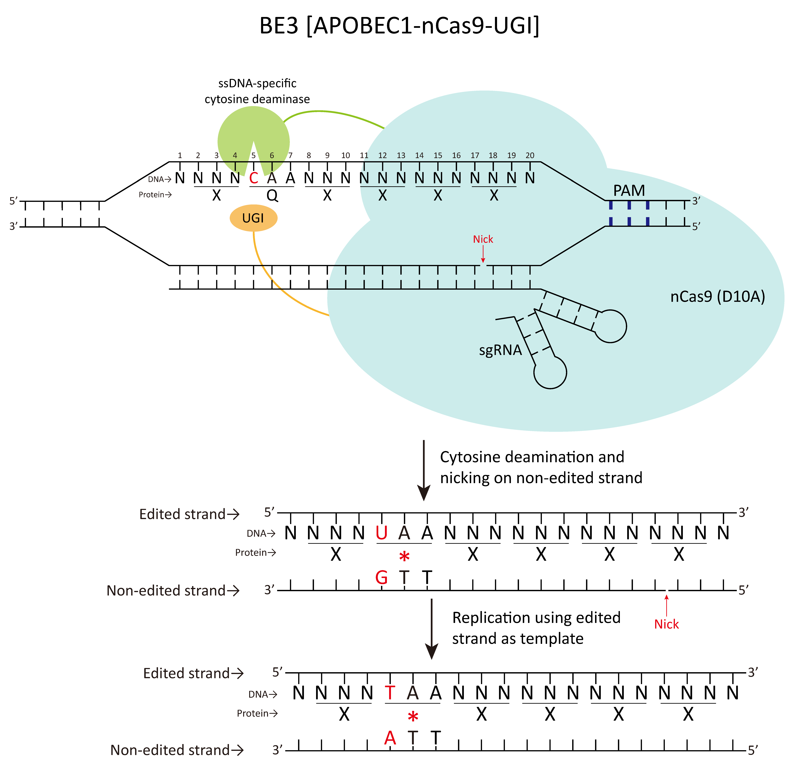

# CrisprCBEI
CrisprCBEI is a front-end designing tool for Cytosine Base Editor mediated gene Inactivation. 
We provide the online version, HTML version, local server version and corresponding Python version. CrisprCBEI can not only design editing sites that cause target gene inactivation but also make off-target predictions on the web-page without uploading the genome to the server.

 Schematic representation of the bias of cytosine base editors.

CrisprCBEI online version and offline version are purely front-end software means that all calculations are performed locally, without the need to upload data to the server. Therefore, for the off-target prediction function, the user can select local genome files of any size to make an off-target prediction with a simple click. Of course, for the single-thread limitation of the browser, it is certainly not as efficient as the known server version of off-target prediction tools (such as CasOffinder). However, we have optimized the computational efficiency of this tool, and for the human genome (2.92gb) on a regular computer (i7 3770), each spacer only takes 36 seconds.For genomes less than 50MB, a spacer computation can take less than 1 second. This version,  we also made a detailed user manual, for everyone's convenience.

It is explained in detail in README.md file of the corresponding folder.

## CrisprCBEI online version
The online version can access from (https://taolab.nwsuaf.edu.cn/CrisprCBEI/), 

## CrisprCBEI offline version

The offline version is divided into the local server version and the HTML version.

CrisprCBEI is pure front-end software, so we first introduced the HTML version, which can run the software in a browser by merely opening an HTML file. However, due to browser security, the HTML version only works in a few browsers (currently available in tests with Firefox and Microsoft Edge browsers).So we launched the local server version at the same time.This version can build a local server with a simple command to run in any HTML5 enabled browser (currently all the major browsers).

## CrisprCBEI.py version
For the Python version, CrisprCBEI.py is more efficient and can compute large amounts of data. This python version only allows CBEI predictions.The next off-target prediction can be made using the existing tools.

