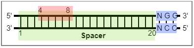

# autocbei


We provided command-line versions that can be used to design the cytosine base editor mediated gene inactivation for large amounts of CDS. 

We developed the 'autocbei' to automate the calculation of potential CBEI loci of the target CDSs and to perform statistics and calculations.

## 1. Install

"autocbei" relies on python3 and requires 'biopython' and 'matplotlib' packages. The current version (1.6.3) supports ‘conda’ and ‘pip’ installations.

### 1.1 Install by conda (Recommended)

Conda (including Anaconda and Miniconda) is a popular way to manage software. It can create and configure a virtual environment without affecting global settings.

First install the corresponding platform of [Anaconda](https://www.anaconda.com/products/individual) or [Miniconda](https://docs.conda.io/en/latest/miniconda.html). We recommend installing python3 version.

Then execute the following command:
```bash
        # Creating a virtual environment of python3.7.
        1. conda create -n runCBEI python=3.7 -y
        
        # Activate the environment
        2. conda activate runCBEI
        
        # Install autocbei
        3. conda install -c atlasbioinfo autocbei -y
```

### 1.2 Install by pip

If **Python3 (Python >= 3.6.0)** is already included in your operating system, autocbei can be automatically installed via pip.

```bash
pip install autocbei
```
Use the following command to determine which version of Python you have installed:
```
python -V
```
If you haven't installed python3 yet, it's recommended to use the 'method 1.1' above.

### 1.3 Install the pre-release version (recommend experienced users)

If you want to try out the latest but **unreleased version (possibly unstable)** of autocbei, please follow these commands:
```bash
        # Download CRISPR-CBEI from Github
        1. git clone https://github.com/atlasbioinfo/CRISPR-CBEI.git
        
        # Install biopython and matplotlib
        2. conda install -y biopython matplotlib 

        # Run autocbei and show help info
        3. python run_autocbei.py -h
```

## 2 Usage

### 2.1 Demo CDS file

If the installation of "autocbei" has been successful, the sample file is located at [PYTHON_HOME]/site-packages/autocbei/Bacillus_subtilis.part500.cds.all.fa

If installed with Conda, it should be located at:
```
~/anaconda3/envs/autocbei/lib/python3.7/site-packages/autocbei/Bacillus_subtilis.part500.cds.all.fa
```

Or, it can be downloaded via "https://github.com/atlasbioinfo/CRISPR-CBEI/blob/master/autocbei/Bacillus_subtilis.part500.cds.all.fa".

### 2.2 Run
The -h parameter shows help information.
```
autocbei -h

        usage: autocbei [-h] [-ns] [-o OUTPREFIX] CDS.fasta

        Enter fasta file of CDSs, output base editor's potential editing site and
        statistics information. The demo CDS Fasta file: "[PATHON_HOME]/site-
        packages/autocbei/Bacillus_subtilis.part500.cds.all.fa".

        positional arguments:
        CDS.fasta             CDSs in fasta format.

        optional arguments:
        -h, --help            show this help message and exit
        -ns, --nostat         Only run CBEI design without statistics and plot.
        -o OUTPREFIX, --outprefix OUTPREFIX
                                Directory prefixes can be customized. Default: "CBEI"
                                (CBEIRaw, CBEIPlot, CBEIRes).
```
Calculate the potential CRISPR base editing site information of CDSs
```
autocbei Bacillus_subtilis.part500.cds.all.fa
```
Calculation only without statistics and ploting:
```
autocbei -ns Bacillus_subtilis.part500.cds.all.fa -o Bac
```

## 3. Base editors

The autoCBEI contains 13 commonly used base editors.

```python
#Set the Base editor parameter
# [PAM, spacer length, edit beg, edit end, direction]
# Direction refers to spacer at the 5' or 3' end of PAM sequence (5 or 3, respectively).
beinfos = {
    "BE":["NGG",20,4,8,5],
    "YE1-BE3":["NGG",20,5,7,5],
    "EE-BE3":["NGG",20,5,6,5],
    "YEE-BE3":["NGG",20,6,6,5],
    "VQR-BE3":["NGAN",20,4,11,5],
    "VRER-BE3":["NGCG",20,3,10,5],
    "SaBE":["NNGRRT",21,3,12,5],
    "Sa(KKH)-BE3":["NNNRRT",21,3,12,5],
    "Cas12a–BE":["TTTV",20,10,12,3],
    "Target-AID":["NGG",20,2,4,5],
    "Target-AID-NG":["NG",20,2,4,5],
    "xBE3":["NG",20,4,8,5],
    "BE-PLUS":["NGG",20,4,14,5]
	# Or, add your own Base editors
    # "BE name" :[PAM, SpLength, EditBeg, EditEnd, Direction]
}
```




> **PAM**: PAM sequence.

> **SpLength**: Spacer length.

> **EditBeg**: Edit windows begin.

> **EditEnd**: Edit windows end.

> **Direction**: 5 or 3. Spacer is at the 5 'end or 3' end of the PAM sequence. The example in the figure is the 5.

## 4 Output

### 4.1 Output message

The output message of simply run 
```bash
autocbei Bacillus_subtilis.part500.cds.all.fa
```
should be:
```
Input file: Bacillus_subtilis.part500.cds.all.fa
Output directory: CBEIRaw
Base editors:
        BE      PAM     Spacer  EditBegin       EditEnd Direction
        BE      NGG     20      4       8       5
        YE1-BE3 NGG     20      5       7       5
        EE-BE3  NGG     20      5       6       5
        YEE-BE3 NGG     20      6       6       5
        VQR-BE3 NGAN    20      4       11      5
        VRER-BE3        NGCG    20      3       10      5
        SaBE    NNGRRT  21      3       12      5
        Sa(KKH)-BE3     NNNRRT  21      3       12      5
        Cas12a–BE       TTTV    20      10      12      3
        Target-AID      NGG     20      2       4       5
        Target-AID-NG   NG      20      2       4       5
        xBE3    NG      20      4       8       5
        BE-PLUS NGG     20      4       14      5
Start calculating: BE
CBEI calculation of base editor "BE" , done!
Start calculating: YE1-BE3
CBEI calculation of base editor "YE1-BE3" , done!
Start calculating: EE-BE3
CBEI calculation of base editor "EE-BE3" , done!
Start calculating: YEE-BE3
CBEI calculation of base editor "YEE-BE3" , done!
Start calculating: VQR-BE3
CBEI calculation of base editor "VQR-BE3" , done!
Start calculating: VRER-BE3
CBEI calculation of base editor "VRER-BE3" , done!
Start calculating: SaBE
CBEI calculation of base editor "SaBE" , done!
Start calculating: Sa(KKH)-BE3
CBEI calculation of base editor "Sa(KKH)-BE3" , done!
Start calculating: Cas12a–BE
CBEI calculation of base editor "Cas12a–BE" , done!
Start calculating: Target-AID
CBEI calculation of base editor "Target-AID" , done!
Start calculating: Target-AID-NG
CBEI calculation of base editor "Target-AID-NG" , done!
Start calculating: xBE3
CBEI calculation of base editor "xBE3" , done!
Start calculating: BE-PLUS
CBEI calculation of base editor "BE-PLUS" , done!
Calculate complete!
Begin statistics...
The statistics directory: CBEIStat
The plot directory: CBEIPlot
####################
Pie charts for different BEs have been generated.
Path:
        CBEIPlot/[BE names]_Bacillus_subtilis.statPie.png
Transcript statistics and mapping completed.
Path:
        CBEIPlot/Bacillus_subtilis_CDSlength.png
        CBEIPlot/Bacillus_subtilis_GCstats.png
        CBEIPlot/Bacillus_subtilis_CodonUsage.png
        CBEIPlot/Bacillus_subtilis_CDSlength.png
The comparison of CBEI ratio of different BE has been completed.
Path:
        CBEIPlot/Bacillus_subtilis.statBar.png
        CBEIPlot/Bacillus_subtilis.statROC.png
CBEI statistics complete
```
### 4.2 Output files

The output directory or files shold be:
```
├── CBEIPlot
│   ├── BE-PLUS_Bacillus_subtilis.statPie.png
│   ├── BE_Bacillus_subtilis.statPie.png
│   ├── Bacillus_subtilis.statBar.png
│   ├── Bacillus_subtilis.statROC.png
│   ├── Bacillus_subtilis_CDSlength.png
│   ├── Bacillus_subtilis_CodonUsage.png
│   ├── Bacillus_subtilis_GCstats.png
│   ├── ...
├── CBEIRaw
│   ├── BE-PLUS_Bacillus_subtilis.part500.cds.all.fa.cbei
│   ├── BE_Bacillus_subtilis.part500.cds.all.fa.cbei
│   ├── ...
├── CBEIStat
│   ├── BE-PLUS_Bacillus_subtilis.Thre025.tsv
│   ├── BE-PLUS_Bacillus_subtilis.Thre05.tsv
│   ├── BE-PLUS_Bacillus_subtilis.Thre075.tsv
│   ├── ...

```

#### 4.2.1 .cbei files format

```
KDE22635	Minus	0.8674698795180723	{TGC,[TTT,C(C->T)]A,TAA,GAT,TAA,AA}|T,G	TGCTTTCCATAAGATTAAAA	222-203	216,215	219-215	TG	201-202	TC,CC
```

>1. Fasta title: E.g., lacZ
>2. Strand: E.g., Plus
>3. Relative position: Edit position/Gene length. E.g., 0.012032520325203253
>4. Rich info: E.g., GT{C,GT[T,TTA,(C->T)]AA,CGT,CGT,GAC,T}|GG,G
>5. Spacer: E.g., CGTTTTACAACGTCGTGACT
>6. Spacer position: E.g., 30-49
>7. Edit position: E.g., 37
>8. Edit windows: E.g., 33-37
>9. PAM:E.g., GGG
>10. PAM position: E.g., 50-52
>11. Edit pattern: The edit pattern indicated the adjacent nucleotide at 5’ of the editable cytosine. Typically, the in vitro activity of the base editors follows TC ≥ CC ≥ AC > GC. E.g., AC

#### 4.2.2 .tsv files with threshold

Filter according to different thresholds. 
>* Thre25: CBEI sites at the upsteam 25% of the CDS.
>* Thre50: CBEI sites at the upsteam 50% of the CDS.
>* Thre75: CBEI sites at the upsteam 75% of the CDS.

```
#Editable sites in the first 50% of the transcript
#Transcript	Strand	Position	CBEIdetail	Spacer	SpacerRegion	EditPosition	EditWindowsRegion	PAM	PAMregion	Pattern

KDE22636	Plus	0.3686274509803922	GG{A,TT[T,CTT,(C->T)]AA,CAA,ACA,GTA,C}|TG,G	ATTTCTTCAACAAACAGTAC	87-106	94	90-94	TGG	107-109	TC
```

### 4.3 Figures

```
Pie charts for different BEs have been generated.
Path:
        ./CBEIPlot/[BE names]_Bacillus_subtilis.statPie.tiff
Transcript statistics and mapping completed.
Path:
        ./CBEIPlot/Bacillus_subtilis_CDSlength.tiff
        ./CBEIPlot/Bacillus_subtilis_GCstats.tiff
        ./CBEIPlot/Bacillus_subtilis_CodonUsage.tiff
        ./CBEIPlot/Bacillus_subtilis_CDSlength.tiff
The comparison of CBEI ratio of different BE has been completed.
Path:
        ./CBEIPlot/Bacillus_subtilis.statBar.tiff
        ./CBEIPlot/Bacillus_subtilis.statROC.tiff
CBEI statistics complete
```
